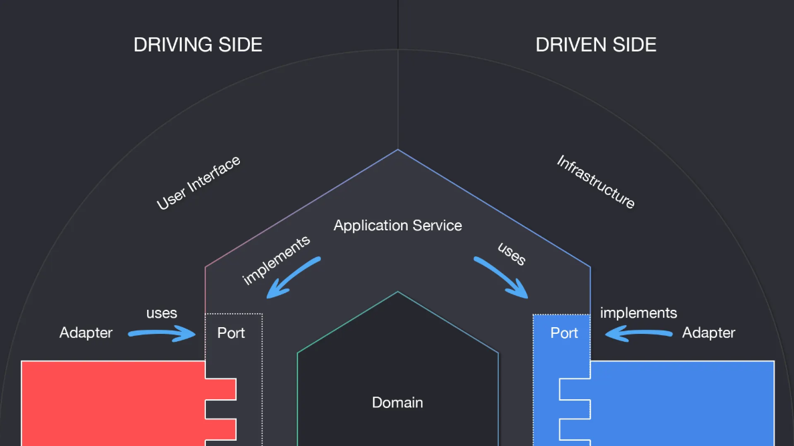

# Hexagonal Architecture w/ Spring Boot 4.0.1

## What is it
**System Design Pattern** merupakan topik yang cukup sering dibahas. Topik yang cukup 
popular adalah **Software Architectural Pattern**. Satu topik ini memiliki banyak tipe, 
dua tipe paling sering dijumpai adalah **N-Tier Architecture** dan **Hexagonal Architecture**.
  
Traditional architecture atau N-Tier adalah acitecture yang biasanya terdiri dari
Layer-layer seperti Presentation/Controller, Business Logic/Core Logic/Service,
Data Layer/Repository dan layer lainnya (tidak ada atruan baku terkait jumlah layer).
Jenis ini memiliki tujuan utama untuk memisahkan aplikasi menjadi memiliki tier.

Setiap layer atau tier memiliki class atau module dengan tanggung jawab yang hampir
sama. Menggunakan pendekatan ini dapat memberikan banyak manfaat, salah satunya adalah
**separation of concern**. Manfaat yang ada cocok untuk project dengan skala kecil, 
namun ketika project mulai besar dan kompleks akan muncul hal yang berulang, yaitu 
setiap kali ada update perubahan programmer tidak akan lepas dari merubah core logic
atau bussiness logicnya.
  
Hexagonal Architecture muncul menjawab masalah dari N-Tier Architecture. Jenis ini 
memiliki sebutan lain yaitu **Ports** dan **Adapter**. Architecture ini memiliki tujuan
utama untuk memisahkan core logic dari external system seperti **API's**,**Database/DB**,
**File System/FS**, **Message Queue/MQ** dan lainnya menggunakan komponen seperti 
Ports dan Adapter, sehingga ketika skala project semakin kompleks, programmer tidak
perlu melakukan perubahan dari logic code. Port digunakan untuk mendefinisikan apa 
yang bisa dilakukan oleh Applikasi (biasanya disebut usecase). Adapter digunakan untuk
menyambungkan input dan output ke external system.

## 
